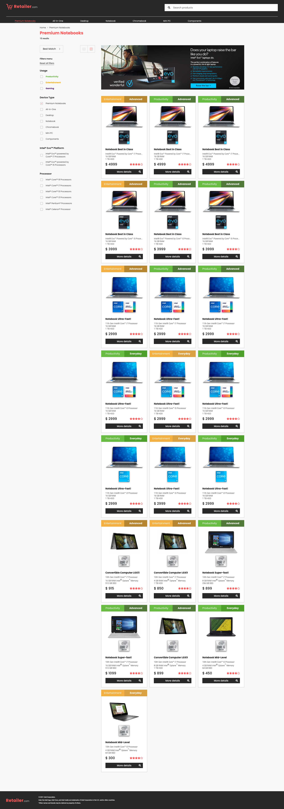
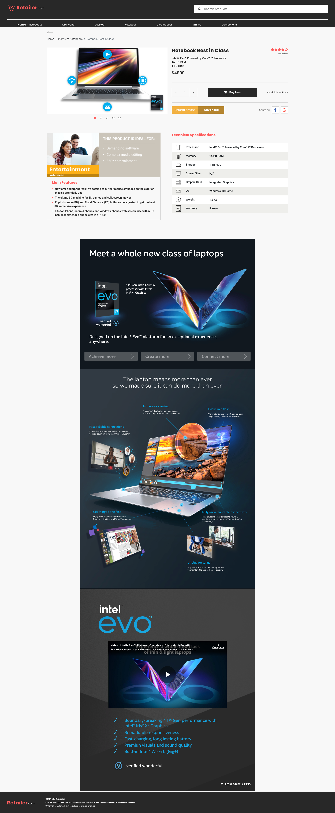

# Prueba técnica Full Stack

La idea es armar un pequeño sitio en NodeJS, Express con dos vistas. 

1. La grilla de productos
2. Vista del producto

Los datos se pueden tomar de la carpeta data donde hay un Json con especificaciones que nos servirá para usar como una base de datos estática. El json tiene rutas a imágenes e incluso links.

## Paso dos

Luego de tener la vista, la idea sería llamar a una url y traer el json. Depende de la ruta se llama a dos json distintos.
1. https://s3-sa-east-1.amazonaws.com/api.sis/embedded/PE_LaCuracao/SRT/data/products.json
2. https://s3.sa-east-1.amazonaws.com/api.sis/embedded/PE_Falabella/srt/data/products.json

## Vistas

El sistema de vistas se puede manejar a su gusto. Pero NO HAY QUE USAR ningun framework ya sea react o alguno css como bootstrap. Dejo una muestra que pueden usar como inspiración. No tiene que estar tal cual.

